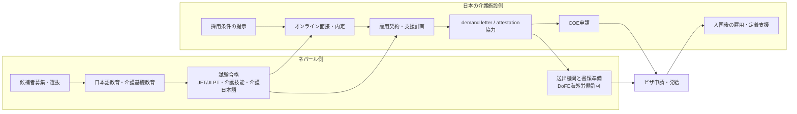

# 07. 취업 타임라인·주체별 역할

[← 위키 홈](./README.md) · 관련: [01 제도](./01-제도-비자.md) · [04 비용](./04-수익모델-비용검증.md) · [06 경쟁사](./06-경쟁사-신규비자-시장규모.md)

> **결론:** 학생은 학교를 졸업한다고 바로 일본에 가는 것이 아니다. 실제 취업은 **선발 → 교육·시험 합격 → 일본 고용처 매칭·고용계약 → demand attestation → 네팔 해외노동허가 → 일본 COE → 비자 → 입국·취로** 순서로 완성된다. 직업훈련학교는 교육과 후보자 관리를 맡고, 제휴 송출기관은 네팔 노동허가·송출 실무를 맡으며, 일본 수용기관은 고용계약·COE·지원계획의 실질 주체다.

---

## 0. 일본 개호시설 제안용 쉬운 설명

일본 개호시설에는 “네팔에서 사람을 모집해 보냅니다”보다 **시설이 안심할 수 있는 채용 파이프라인**으로 설명하는 편이 좋다. 핵심 메시지는 아래 5가지다.

| 시설이 궁금해할 질문 | 쉬운 답 |
|---|---|
| 어떤 인재를 소개하나? | 네팔에서 선발한 후보자에게 일본어와 개호 기초교육을 시키고, 특정기능1호(개호)에 필요한 일본어·기능시험 합격자를 중심으로 소개한다. |
| 시설은 무엇을 하면 되나? | 채용조건을 제시하고, 온라인 면접을 보고, 내정 후 고용계약·지원계획·COE 신청·입국 후 지원을 담당한다. 등록지원기관에 위탁할 수 있다. |
| 우리가 대신 해주는 일은 무엇인가? | 네팔 현지 모집·교육·시험준비·후보자 관리, 제휴 송출기관과의 서류 조율, 출국 전 교육, 입국 후 초기 사후관리를 지원한다. |
| 비용은 어떻게 보나? | 후보자가 일본 개호시설·등록지원기관에 내는 돈은 0원이어야 한다. 시설은 일본 측 고용주로서 지원계획, COE, 입국 후 지원, 필요 시 demand attestation 관련 비용을 부담한다. |
| 가장 큰 리스크는 무엇인가? | 시험 불합격, 면접 탈락, demand attestation 지연, COE·비자 보완 가능성이 있다. 그래서 첫 계약은 소수 파일럿으로 시작하는 것이 안전하다. |

### 시설에 보여줄 한 문장 제안

> 弊社は、ネパールで日本語と介護基礎教育を受けた候補者を、特定技能1号（介護）の採用候補としてご紹介します。貴施設には、面接・雇用契約・支援計画・COE申請・入国後支援を担当いただき、ネパール側の募集、教育、送出機関との書類調整、出国前準備は弊社側で支援します。候補者が日本側の受入機関・登録支援機関へ支払う費用は0円とし、法令上必要な支援費用は受入機関側で適切に負担する設計です。

### 일본 개호시설 관점의 채용 다이어그램



### 시설 측 비용·업무 부담 요약

| 구분 | 일본 개호시설 부담 | 비고 |
|---|---|---|
| 후보자 소개 전 | 채용조건, 급여, 근무지, 기숙사·주거지원 가능 여부 정리 | 조건이 명확할수록 면접 전환율이 높아진다. |
| 면접·내정 | 온라인 면접, 내정 여부 결정 | 내정 후 근로조건이 바뀌면 COE·비자 단계에서 리스크가 커진다. |
| 고용계약·지원계획 | 고용계약 작성, 특정기능 지원계획 작성 또는 등록지원기관 위탁 | 지원비용을 후보자에게 전가하면 안 된다. |
| demand attestation | 대사관 인증비 **¥46,000/up to 25 workers** 발생 가능 | SSW 적용 여부·결제방법은 제출 전 주일 네팔대사관 확인 필요. |
| COE 신청 | 일본 출입국재류관리청 COE 신청·보완 대응 | 실질 고용주는 일본 개호시설이므로 시설 측 서류 품질이 중요하다. |
| 입국 후 | 생활 오리엔테이션, 주민등록, 은행, 보험, 상담 등 의무적 지원 | 직접 수행하거나 등록지원기관에 위탁 가능. 학생에게 비용 청구 금지. |

---

## 1. 전체 흐름 한 장 요약

```
학생 모집·선발
  ↓
입학계약·비용납부·기초 오리엔테이션
  ↓
일본어 + 직무교육
  ↓
JFT-Basic/JLPT + 분야별 기능시험 합격
  ↓
일본 고용처 매칭·면접
  ↓
고용계약 + 지원계획 + demand letter
  ↓
주일 네팔대사관 demand attestation
  ↓
네팔 DoFE 해외노동허가·송출 승인
  ↓
일본 출입국재류관리청 COE 신청·교부
  ↓
재네팔 일본대사관 비자 신청·발급
  ↓
출국·입국·재류카드 교부·취로 개시
  ↓
입국 후 의무적 지원·정착 관리
```

순서는 실무상 일부 병행될 수 있다. 다만 **시험 합격, 고용계약, demand attestation, DoFE clearance, COE, 비자**는 모두 통과해야 한다.

### 단계별 비용 부담 요약(학생 1인 기준, 운영안)

| 흐름 | 학생 부담 | 직업훈련학교 | 제휴 송출기관 | 우리 회사/영업파트 | 일본 수용기관/등록지원기관 |
|---|---:|---:|---:|---:|---:|
| 모집·상담·선발 | 0원 가정 | 모집·상담비 부담(미산정) | 참여 시 실무비 부담(미산정) | 영업·운영 준비비 부담(미산정) | 채용수요 제시 비용 부담(미산정) |
| 입학계약·비용납부 | **700만원 납부** | **200만원 수취** | **200만원 수취 가정** | **300만원 수취 가정** | 0원 |
| 일본어·직무교육 | 700만원 안에 포함 | 200만원 범위에서 교육 운영 | 0원 또는 송출 준비비는 200만원 범위 | 운영관리비는 300만원 범위 | 0원 |
| 시험 응시 | 추가 시험료·교재비는 별도 고지 필요 | 교육·모의시험 운영비 부담 | 0원 | 0원 | 0원 |
| 고용처 매칭·면접 | 일본 수용기관·등록지원기관에 지급 **0원** | 후보자 관리비 부담 | 서류 협조비는 200만원 범위 | 일본/한국 영업비는 300만원 범위 | 면접·채용 실무비 부담(미산정) |
| 고용계약·지원계획 | 0원 | 0원 | 서류 협조비는 200만원 범위 | 0원 | 지원계획 작성·등록지원 위탁비 부담(금액 미산정, 학생 전가 금지) |
| demand attestation | 0원 | 0원 | 서류 처리비는 200만원 범위 | 0원 | 대사관 인증비 **¥46,000/up to 25 workers** 발생 가능(100엔=900원 가정 시 약 41만원) |
| 네팔 DoFE 해외노동허가 | 700만원 중 송출기관 수수료에 포함시키는 구조가 안전 | 0원 | 200만원 범위에서 송출 실무 수행 | 0원 | 0원 |
| COE·비자 | 일본 측 행정비 부담 0원. 비자 실비·사진·여권 등 개인 실비는 별도 확인 | 0원 | 비자서류 협조비는 200만원 범위 | 0원 | COE 신청·보완·고용관리 행정비 부담(금액 미산정, 학생 전가 금지) |
| 출국·입국·정착 | 항공권·초기 생활비·주거비 부담 여부는 고용처별 확인 | 출국 전 교육비 부담 | 출국 행정 협조비는 200만원 범위 | 사후관리비는 300만원 범위 | 입국 후 의무적 지원비 부담(금액 미산정, 학생 전가 금지) |

> 핵심은 **학생이 네팔에서 납부하는 700만원**과 **일본 수용기관·등록지원기관이 부담해야 하는 지원비·행정비**를 계약서·영수증·자금흐름에서 분리하는 것이다. 금액이 미산정인 항목은 파일럿 전에 실제 견적과 환불규정으로 확정해야 한다.

---

## 2. 단계별 타임라인

| 단계 | 시점(파일럿 가정) | 학생에게 일어나는 일 | 주관 주체 | 산출물/게이트 |
|---|---|---|---|---|
| 0. 사업 준비 | 모집 전 | 학생에게 직접 발생 없음 | 우리 회사, 직업훈련학교, 일본 영업파트, 제휴 송출기관 | 일본 고용처 후보, DoFE active 송출기관, 계약서·환불규정·광고문구 준비 |
| 1. 모집·상담 | T0 | 설명회·상담, 일본행 비용·리스크 안내, 개호/숙박 희망 확인 | 직업훈련학교, 모집팀 | 상담기록, 지원서, 과장광고 금지 확인 |
| 2. 선발 | T0~T+2주 | 일본어 기초, 학력·연령, 건강, 직무적성, 비용조달 가능성 평가 | 직업훈련학교 | 선발/보류/불합격 결정. 숙박 희망자는 회화·서비스 적성 별도 확인 |
| 3. 입학계약·수납 | T+2주 | 교육·송출수수료·환불규정이 분리된 계약 체결, 네팔 내 비용 납부 | 직업훈련학교, 제휴 송출기관 | 학생 계약서, 영수증, 환불규정. 일본 수용기관·등록지원기관에는 학생 지급 0원 |
| 4. 교육 | T+2주~T+3~6개월 | 일본어, 직무교육, 모의시험, 면접 준비 | 직업훈련학교 | 출석률, 모의시험 점수, 중도탈락 관리 |
| 5. 시험 | T+3~6개월 | JFT-Basic 또는 JLPT N4, 분야별 기능시험 응시 | 학생, 시험기관 | 개호: 일본어 + 개호기능 + 개호일본어. 숙박: 일본어 + 숙박기능시험 |
| 6. 후보자 풀 편입 | 시험 합격 후 | 합격증·이력서·영상면접 자료 정리 | 직업훈련학교, 우리 회사 | 일본 고용처에 제시 가능한 후보자 프로필 |
| 7. 고용처 매칭·면접 | 시험 합격 후~ | 일본 개호시설·호텔과 면접, 직무·임금·근무지 확인 | 일본 영업파트, 일본 수용기관, 직업훈련학교 | 채용내정 또는 탈락. 탈락자는 재매칭 |
| 8. 고용계약·지원계획 | 내정 후 | 근로조건 설명을 받고 고용계약 체결 | 일본 수용기관, 등록지원기관(위탁 시) | 고용계약서, 특정기능 지원계획, 사전 가이던스 |
| 9. demand attestation | 고용계약 후 | 학생은 필요 서류 제공 | 일본 수용기관, 제휴 송출기관, 주일 네팔대사관 | demand letter, inter-party agreement, 송출기관 license, DoFE clearance 등 확인. 대사관 인증비 발생 가능 |
| 10. 네팔 해외노동허가 | attestation 전후 | 네팔 국내 출국·노동허가 절차 진행 | 제휴 송출기관, DoFE/MoLESS | overseas labour approval/clearance. 제휴 송출기관 실무력이 핵심 |
| 11. COE 신청 | 계약·서류 준비 후 | 학생은 서류 보완 | 일본 수용기관, 일본 출입국재류관리청 | 재류자격인정증명서(COE) 교부 또는 보완/불허 |
| 12. 비자 신청 | COE 교부 후 | 재네팔 일본대사관에 비자 신청 | 학생, 제휴 송출기관, 재네팔 일본대사관 | 비자 발급 또는 보완/불허 |
| 13. 출국 전 교육 | 비자 발급 후 | 일본 생활·근로규칙·금전관리·이탈 리스크 교육 | 직업훈련학교, 송출기관, 일본 수용기관/등록지원기관 | 출국 오리엔테이션, 항공권, 입국일 확정 |
| 14. 입국·취로 개시 | 입국일 | 공항 입국, 재류카드 교부, 주거 이동, 근무 시작 | 일본 수용기관, 등록지원기관 | 재류카드, 주민등록, 은행·보험 등 생활정착 지원 |
| 15. 사후관리 | 입국 후 1~12개월 | 정착, 고충상담, 이직 방지, 시험·경력관리 | 일본 수용기관, 등록지원기관, 우리 회사 | 정기면담, 민원 처리, 이탈·분쟁 관리 |

---

## 3. 단계별 서류 교환 체크리스트

아래 표는 특정기능1호(SSW) 신규입국 파일럿을 전제로 한 실무 체크리스트다. 실제 제출서류는 분야, 고용처, 등록지원기관 위탁 여부, 네팔 DoFE 처리방식, 일본 입관 보완요구에 따라 달라질 수 있으므로, **대사관·DoFE·출입국재류관리청의 최신 양식으로 최종 확정**해야 한다.

| 단계 | 서류를 주고받는 주체 | 주고받는 주요 서류·데이터 | 목적/주의점 |
|---|---|---|---|
| 0. 사업 준비 | 우리 회사·직업훈련학교·제휴 송출기관·일본 영업파트 | 업무분장표, MOU/업무위탁계약, 수수료·환불규정 초안, 학생 설명자료, 개인정보 취급·제3자 제공 동의서 양식, 광고문구, 송출기관 DoFE license/active 상태 확인자료, 일본 수용기관 후보 리스트 | 모집 전에 “누가 무엇을 책임지는지”를 문서화한다. 송출기관 license와 일본 측 비용 부담 구조가 불명확하면 모집을 시작하지 않는다. |
| 1. 모집·상담 | 학생 → 직업훈련학교/모집팀 | 상담신청서, 신분증 또는 여권 사본, 연락처, 희망분야(개호/숙박), 학력·경력 기본정보, 일본어 학습이력, 비용조달 가능성 확인, 개인정보 동의서 | 허위·과장광고 방지용 상담기록을 남긴다. 여권이 없으면 여권 발급 일정도 같이 관리한다. |
| 1. 모집·상담 | 직업훈련학교/모집팀 → 학생 | 제도 설명서, 전체 타임라인, 비용명세서, 환불규정, 시험·면접·COE·비자 탈락 리스크 고지서 | “학교 등록 = 일본 취업 보장”으로 읽히는 문구를 피한다. 학생이 이해하는 언어로 설명했다는 기록을 남긴다. |
| 2. 선발 | 학생 → 직업훈련학교 | 지원서, 이력서 초안, 학력증명 또는 수료증, 경력증명(있는 경우), 일본어 레벨 체크 결과, 건강 자기신고, 보호자/가족 연락처(내부관리용) | COE나 비자에 바로 제출할 서류와 내부 평가자료를 구분한다. 허위 경력은 나중에 입관 리스크가 된다. |
| 2. 선발 | 직업훈련학교 → 학생/우리 회사 | 선발결과 통지, 교육 배정표, 보류·불합격 사유, 보충학습 권고서 | 불합격·보류 사유를 남겨 환불분쟁과 차별 리스크를 줄인다. |
| 3. 입학계약·수납 | 직업훈련학교/송출기관/우리 회사 → 학생 | 교육계약서, 송출·행정지원 범위 설명서, 비용명세서, 단계별 환불규정, 영수증 양식, 수업규정 | 교육비, 송출기관 수수료, 일본 측 지원비를 계약서와 영수증에서 분리한다. 일본 수용기관·등록지원기관에 학생이 지급하는 금액은 0원 구조로 둔다. |
| 3. 입학계약·수납 | 학생 → 직업훈련학교/송출기관 | 서명한 계약서, 납부확인서, 여권 사본 또는 여권 신청증빙, 긴급연락처 | 현금 수납은 영수증과 장부를 반드시 맞춘다. 중도탈락·시험불합격·COE 불허 시 환불 기준을 계약서에 연결한다. |
| 4. 교육 | 직업훈련학교 → 학생/우리 회사 | 출석부, 월별 성적표, 모의시험 결과, 보충수업 기록, 생활태도·면접준비 평가표 | 일본 고용처에 보여줄 자료와 내부관리 자료를 분리한다. 개인정보 공유는 사전 동의 범위 안에서만 한다. |
| 4. 교육 | 학생 → 직업훈련학교 | 과제, 모의면접 영상/녹음 동의, 학습계획 확인서, 결석 사유서 | 나중에 후보자 추천자료로 쓸 수 있으나, 영상·사진은 별도 사용동의가 필요하다. |
| 5. 시험 | 학생 ↔ 시험기관 | 시험 신청정보, 여권/신분증, 수험표, 응시료 영수증, JFT-Basic 또는 JLPT 결과, 분야별 기능시험 합격증, 개호일본어평가시험 합격증(개호 분야) | 특정기능1호는 일본어와 분야별 기능요건 증빙이 핵심이다. 개호는 일본어, 개호기능, 개호일본어를 분리 관리한다. |
| 6. 후보자 풀 편입 | 학생/직업훈련학교 → 우리 회사/일본 영업파트 | 표준 이력서, 후보자 프로필, 여권 사본, 사진, 시험 합격증, 교육 출석·성적 요약, 희망직무·근무지, 개인정보 제3자 제공 동의서 | 일본 고용처에 전달되는 “외부제공 패키지”를 표준화한다. 민감정보는 필요한 범위로 최소화한다. |
| 7. 고용처 매칭·면접 | 일본 수용기관 → 학생/우리 회사 | 구인표, 직무기술서, 근로조건 초안, 임금·근무시간·휴일·야근·기숙사/주거지원 정보, 면접 일정표 | 면접 전에 급여·근무지·교대근무·주거비 부담을 명확히 해야 내정 후 조건 변경 리스크가 줄어든다. |
| 7. 고용처 매칭·면접 | 학생/우리 회사 → 일본 수용기관 | 이력서, 후보자 프로필, 시험 합격증, 면접 가능일, 질문지, 면접 동의서 | 합격증 원본 제출 전에는 사본·스캔본으로 확인하고, 원본 제출 필요 시 수령기록을 남긴다. |
| 7. 고용처 매칭·면접 | 일본 수용기관 → 학생/우리 회사 | 면접평가표, 채용내정 통지서 또는 불합격 통지, 보완요청 목록 | 내정 통지에는 직무, 근무지, 급여, 입사예정일, COE 진행 조건을 연결한다. |
| 8. 고용계약·지원계획 | 일본 수용기관 → 학생 | 특정기능 고용계약서, 고용조건서, 보수·공제항목 설명, 사전 가이던스 자료, 지원계획 설명자료 | 학생이 이해하는 언어로 근로조건과 지원내용을 설명한다. 임금은 같은 업무의 일본인과 동등 이상이라는 원칙을 확인한다. |
| 8. 고용계약·지원계획 | 일본 수용기관 ↔ 등록지원기관(위탁 시) | 등록지원기관 등록정보, 지원위탁계약서, 역할분담표, 연락체계, 상담창구 정보 | 등록지원기관은 고용주가 아니라 지원업무 위탁기관이다. 지원비를 학생에게 청구하지 않는 구조를 계약서에서 확인한다. |
| 8. 고용계약·지원계획 | 학생 → 일본 수용기관/등록지원기관 | 서명한 고용계약서·고용조건서, 여권 사본, 시험 합격증, 학력·경력 증빙, 연락처, 사전 가이던스 확인서 | 서명본은 학생·수용기관·송출기관이 동일 버전을 보관한다. 일본어 원문만 두지 말고 번역본 또는 설명기록을 남긴다. |
| 9. demand attestation | 일본 수용기관/등록지원기관/송출기관 → 주일 네팔대사관 | SSW Demand Attestation 서류: Request Letter, Demand Letter, Power of Attorney, Guarantee Letter, Employment Contract, Inter Party Agreement, 수용기관 profile·최근 2년 재무자료, 등기부(Tohon), 기존 네팔인 고용기록, 인감증명, 네팔 송출기관 license, DoFE clearance letter 등 | 주일 네팔대사관이 공개한 SSW 요구서류 목록 기준이다. 서명·인감·원본 여부, 3개월 이내 발급 조건, 온라인 제출 여부를 제출 직전에 확인한다. |
| 9. demand attestation | 등록지원기관이 대리 제출하는 경우 | 등록지원기관 회사등록/등기, 인감증명, Toroku Shien Kikan license, 네팔에서 업무할 권한, 회사 profile, 수용기관과의 agreement, 제출 위임장 | 대사관 목록상 등록지원기관 경유 시 추가서류가 붙는다. 등록지원기관이 수용기관 대신 제출할 권한이 문서로 확인되어야 한다. |
| 9. demand attestation | 주일 네팔대사관 → 제출자/송출기관 | 접수확인, 보완요청, attested demand documents, 반송용 Letter Pack 추적정보(우편 제출 시) | 보완요청이 나오면 일본 수용기관과 송출기관이 동시에 수정해야 한다. 인증비 적용 여부와 납부방식은 SSW 제출 전 대사관에 재확인한다. |
| 10. 네팔 해외노동허가 | 송출기관/학생 → DoFE/MoLESS | attested demand documents, 고용계약서, 학생 여권, 사진, 비자 또는 COE 진행자료, 건강검진서, 보험·복지기금·오리엔테이션 관련 증빙, 송출기관 신청서류 | 네팔 내부의 pre-approval/final labour approval 절차와 요구서류는 송출기관이 최신 DoFE 기준으로 확인해야 한다. 학생에게 추가 실비가 있으면 사전 고지한다. |
| 10. 네팔 해외노동허가 | DoFE/MoLESS → 송출기관/학생 | labour approval/clearance, 보완요청, 출국허가 관련 확인자료 | DoFE 승인 전에는 출국 가능성을 확정적으로 말하지 않는다. 승인번호·발급일·유효기간을 후보자 파일에 기록한다. |
| 11. COE 신청 | 학생/송출기관/직업훈련학교 → 일본 수용기관 | 여권 사본, 사진, 이력서, 시험 합격증, 학력·경력 증빙, 고용계약 서명본, 비용 납부·수수료 설명자료, 건강 관련 자료(요구 시) | 일본 입관 제출용과 내부 참고자료를 구분한다. 번역이 필요한 서류는 번역자·작성일을 남긴다. |
| 11. COE 신청 | 일본 수용기관/등록지원기관 → 출입국재류관리청 | 재류자격인정증명서(COE) 교부신청서, 특정기능 고용계약 관련 서류, 고용조건서, 1호특정기능외국인 지원계획서, 사전가이던스 확인자료, 수용기관 개요·등기·재무·세금/사회보험 관련 자료, 등록지원기관 위탁 관련 서류, 분야별 협의회·분야별 요건 자료, 시험 합격증 | 입관의 “특定技能 관계 신청·届出 양식”과 제출서류 목록을 기준으로 준비한다. 수용기관의 세금·사회보험 미비는 COE 보완 리스크가 된다. |
| 11. COE 신청 | 출입국재류관리청 → 일본 수용기관 | 접수표, 보완요청, COE 교부 또는 불교부 통지 | 보완요청은 기한관리표로 추적한다. COE 교부 후 원본/전자문서 전달방식을 학생·송출기관과 맞춘다. |
| 12. 비자 신청 | 일본 수용기관/송출기관 → 학생 | COE, 고용계약서 사본, 지원계획 관련 설명자료, 대사관 제출 체크리스트 | COE가 있어도 비자 발급이 자동은 아니다. 재네팔 일본대사관의 최신 제출목록을 기준으로 최종 확인한다. |
| 12. 비자 신청 | 학생/송출기관 → 재네팔 일본대사관 | 여권, 비자신청서, 사진, COE, 고용계약서·내정자료, 네팔 노동허가 관련 자료(요구 시), 기타 보완자료 | 대사관별 요구가 달라질 수 있으므로 제출 전 최신 안내를 확인한다. 여권 유효기간과 영문 성명 일치 여부를 반드시 대조한다. |
| 13. 출국 전 교육 | 직업훈련학교/송출기관/수용기관/등록지원기관 → 학생 | 출국 전 오리엔테이션 자료, 근로규칙 요약, 생활가이드, 비상연락망, 주거·공항픽업 안내, 항공권/e-ticket, 소지서류 체크리스트 | 학생이 일본 도착 후 누구에게 연락할지 명확해야 한다. 계약서·COE·여권·비자·labour approval 사본을 학생이 보관한다. |
| 13. 출국 전 교육 | 학생 → 송출기관/수용기관 | 항공권 확인, 비상연락처, 출국서약/확인서, 건강상태 업데이트, 원본서류 수령확인 | 원본서류를 누가 언제 넘겼는지 기록한다. 출국 직전 조건 변경이 있으면 출국을 멈추고 서류를 다시 맞춘다. |
| 14. 입국·취로 개시 | 학생 → 일본 입국심사/수용기관 | 여권, 비자, COE, 입국카드/세관신고, 고용계약서 사본, 연락처 | 입국 시 재류카드가 교부되는 공항인지 확인한다. 입국일은 고용계약·주거·보험 시작일과 맞춘다. |
| 14. 입국·취로 개시 | 수용기관/등록지원기관 ↔ 지자체·은행·보험기관 | 재류카드, 주민등록, 주소등록, My Number 관련 서류, 은행계좌 개설서류, 건강보험·연금·고용보험·세금 관련 서류, 근무개시 내부서류 | 입국 후 생활지원은 특정기능1호 지원계획의 일부다. 학생에게 지원비를 청구하지 않는다. |
| 15. 사후관리 | 수용기관/등록지원기관 ↔ 학생 | 정기면담 기록, 상담·고충 처리기록, 생활지원 기록, 임금명세서, 휴가·근태자료, 계약변경 설명서 | 특정기능1호는 지원계획 이행기록이 중요하다. 3개월 1회 정기면담 등 제도상 의무를 일정표로 관리한다. |
| 15. 사후관리 | 수용기관/등록지원기관 → 출입국재류관리청 | 수용상황 관련 정기·수시届出, 고용계약 변경届出, 지원계획 변경届出, 퇴직·전직·계약종료 관련届出 | 변경사항을 늦게 신고하면 다음 채용과 COE 심사에 영향을 줄 수 있다. 이직·퇴직 시 학생에게 체류기한과 다음 절차를 안내한다. |
| 15. 사후관리 | 우리 회사/직업훈련학교/송출기관 ↔ 학생/수용기관 | 초기정착 체크리스트, 민원관리표, 이탈위험 알림, 재교육·상담 기록, 다음 기수 개선사항 | 법정 지원의 주체는 일본 수용기관/등록지원기관이다. 우리 회사와 학교는 사후관리 보조 역할로 범위를 명확히 둔다. |

### 서류 묶음별 담당자

| 서류 묶음 | 1차 책임자 | 보조/확인자 |
|---|---|---|
| 학생 모집·입학 계약 묶음 | 직업훈련학교 | 우리 회사, 제휴 송출기관 |
| 교육·시험·후보자 프로필 묶음 | 직업훈련학교 | 학생, 우리 회사 |
| 일본 구인·면접·내정 묶음 | 일본 수용기관/일본 영업파트 | 우리 회사, 직업훈련학교 |
| 고용계약·지원계획 묶음 | 일본 수용기관 | 등록지원기관(위탁 시), 학생 |
| demand attestation 묶음 | 일본 수용기관·제휴 송출기관 | 등록지원기관(대리 제출 시), 주일 네팔대사관 |
| 네팔 해외노동허가 묶음 | 제휴 송출기관 | 학생, DoFE/MoLESS |
| COE 묶음 | 일본 수용기관 | 등록지원기관(위탁 시), 학생, 제휴 송출기관 |
| 비자·출국 묶음 | 학생·제휴 송출기관 | 재네팔 일본대사관, 일본 수용기관 |
| 입국 후 지원·신고 묶음 | 일본 수용기관 | 등록지원기관(위탁 시), 학생 |

---

## 4. 주체별로 실제 하는 일

| 주체 | 핵심 역할 | 하면 안 되는 일/주의 |
|---|---|---|
| **학생** | 수업 출석, 시험 응시, 면접, 서류 제출, 고용계약 확인, 비자 신청 | 일본 수용기관·등록지원기관에 별도 비용 지급 금지. 허위 경력·허위 서류 금지 |
| **직업훈련학교** | 모집 상담, 선발, 일본어·직무교육, 모의시험, 출석·탈락 관리, 출국 전 교육 | 취업·비자 합격을 보장하는 광고 금지. 송출기관 또는 일본 수용기관 권한을 대신 가진 것처럼 설명 금지 |
| **우리 회사/한국 법인** | 일본·한국 기업풀 영업 지원, 운영관리, 계약·지표 관리, 외주용역 수익 처리 | 일본 수용기관이 부담해야 할 지원비용을 학생 700만원에 섞으면 안 됨 |
| **일본 영업파트** | 개호시설·호텔 발굴, 면접 세팅, 채용조건 확인, demand letter 가능성 확인 | 단순 관심 기업을 확정 고용처처럼 홍보 금지 |
| **한국 기업풀 영업파트** | 한국 네트워크를 통해 일본 고용처 또는 관련 기업 연결 | 실질 고용계약 주체가 누구인지 불명확한 구조 금지 |
| **제휴 송출기관** | DoFE 라이선스 기반 송출 실무, demand attestation 서류, 해외노동허가, 출국 행정 | 라이선스 정지·blocked 상태에서 모집 진행 금지. 수수료 명목 불명확 금지 |
| **일본 수용기관** | 직접고용, 임금·근로조건 확정, 고용계약, 지원계획, COE 신청, 입국 후 고용관리 | 지원비용·소개비·행정비를 학생에게 전가 금지 |
| **등록지원기관** | 수용기관이 위탁할 경우 의무적 지원 10항목 수행 | 지원비를 학생에게 청구 금지 |
| **일본 감리단체(기능실습 전용)** | 기능실습 단체감리형에서 송출기관과 실습실시자를 연결하고, 실습기업을 감사·방문지도한다 | 특정기능1호 사업의 필수 주체가 아니다. 감리단체를 SSW 등록지원기관이나 수용기관과 혼동하면 안 된다 |
| **주일 네팔대사관** | demand letter 및 관련 서류 attestation | 사업자가 통제할 수 없는 행정 게이트 |
| **네팔 DoFE/MoLESS** | 해외노동허가, 송출기관 관리 | 사업자가 통제할 수 없는 행정 게이트 |
| **일본 출입국재류관리청** | COE 심사·교부 | COE 불허 가능성 존재. 보완자료 관리 필요 |
| **재네팔 일본대사관** | 비자 심사·발급 | COE가 있어도 비자 보완·불허 가능성 존재 |

### 특정기능1호와 기능실습의 일본 측 주체 차이

| 구분 | 특정기능1호 | 기능실습 |
|---|---|---|
| 실제 고용주 | 일본 수용기관(개호시설·호텔 등) | 실습실시자(회사·공장·농장·시설 등) |
| 일본 내 중간기관 | 등록지원기관은 의무지원 위탁기관. 필수는 아니며 수용기관이 직접 지원할 수 있다 | 감리단체가 송출기관과 실습실시자를 연결하고 감독한다 |
| 해외 쪽 기관 | 네팔은 국내 송출·해외노동허가 절차상 송출기관 관여 가능 | 외국정부 추천·인정 송출기관이 핵심 |
| 학생에게 설명할 포인트 | "일본 회사가 직접 고용하고, 지원계획을 수행한다" | "실습생으로 들어가며, 감리단체가 실습기업을 관리한다" |

Richhood 같은 `JITCO 技能実習` 송출기관 증명서는 기능실습 쪽 서류다. 본 사업이 특정기능1호 신규취업 루트를 목표로 한다면, 해당 서류는 "일본 송출 경험이 있는 기관인지"를 보는 참고자료일 뿐, SSW demand attestation 처리능력이나 특정기능 송출 실적을 직접 증명하지 않는다.

---

## 5. 학생 관점의 실제 체감 흐름

| 학생 질문 | 실제 답 |
|---|---|
| “학교에 돈 내면 바로 일본에 가나?” | 아니다. 시험, 고용처 매칭, 네팔 송출절차, COE, 비자를 모두 통과해야 한다. |
| “누가 나를 고용하나?” | 직업훈련학교가 아니라 일본의 개호시설·호텔 등 **수용기관**이 직접 고용한다. |
| “학교는 무엇을 해주나?” | 일본어·직무교육, 시험준비, 면접준비, 후보자 관리, 출국 전 교육을 한다. |
| “송출기관은 왜 필요한가?” | 네팔 현지 해외노동허가·DoFE 절차와 demand attestation 서류를 처리하기 위해 필요하다. |
| “등록지원기관은 회사인가?” | 일본에서 생활정착 지원을 수행하는 기관이다. 수용기관이 직접 하거나 외부 등록지원기관에 위탁할 수 있다. |
| “일본에서 추가 비용을 내나?” | 원칙적으로 학생이 일본 수용기관·등록지원기관에 내는 돈은 0원이어야 한다. |
| “탈락하면 어떻게 되나?” | 단계별 환불·재교육·재시험·재매칭 규정이 계약서에 있어야 한다. 이 부분이 사업 신뢰의 핵심이다. |

---

## 6. 돈과 서류가 움직이는 타이밍

| 시점 | 돈의 흐름 | 서류의 흐름 | 리스크 |
|---|---|---|---|
| 입학계약 | 학생 → 네팔 직업훈련학교/송출기관/회사 몫 구조 | 학생 계약서, 영수증, 환불규정 | 명목 불명확, 환불분쟁 |
| 시험 준비 | 추가 시험료·교재비가 있으면 별도 고지 필요 | 출석, 모의시험, 합격증 | 중도탈락 |
| 고용내정 | 일본 수용기관이 지원비용 부담 | 이력서, 합격증, 고용조건 | 내정 취소, 임금조건 불일치 |
| demand attestation | 일본 고용처/제출자가 대사관 인증비를 부담할 가능성. 학생에게 일본 측 비용 전가 금지 | demand letter, employment contract, inter-party agreement, 송출기관 license | 대사관 수수료, 서류 보완·지연 |
| COE/비자 | 행정비·대행비 명목 확인 필요 | COE, 비자신청서, 여권, 계약서 | COE 불허, 비자 보완 |
| 입국 후 | 임금 지급 시작, 생활비 발생 | 재류카드, 주민등록, 은행·보험 | 주거·생활비 부담, 이탈 리스크 |

---

## 7. 단계별 KPI

| 구간 | 봐야 할 숫자 | 이유 |
|---|---|---|
| 모집 → 선발 | 상담자 수, 지원자 수, 합격자 수, 비용조달 가능자 수 | 허수 리드 제거 |
| 교육 → 시험 | 출석률, 모의시험 통과율, JFT/JLPT 합격률, 기능시험 합격률 | 교육 품질 측정 |
| 시험 합격 → 면접 | 합격자 중 면접 배정률 | 일본 고용처 확보력 측정 |
| 면접 → 내정 | 내정률, 분야별 내정률(개호/숙박 분리) | 직무·언어 적합도 확인 |
| 내정 → demand attestation | 서류 접수율, 보완률, 처리기간 | 송출기관·일본 고용처 실무력 확인 |
| attestation → COE | COE 신청률, 보완률, 교부율, 처리기간 | 일본 수용기관 행정품질 확인 |
| COE → 비자 | 비자 발급률, 보완률, 불허율 | 최종 입국 리스크 확인 |
| 입국 후 | 3개월 정착률, 6개월 근속률, 민원·이탈 건수 | 장기 평판과 재모집 가능성 확인 |

---

## 8. 병목과 통제 포인트

| 병목 | 왜 중요한가 | 통제 방법 |
|---|---|---|
| 일본어 전환율 | JFT/JLPT가 첫 번째 대량 탈락 구간 | 입학 선발, 월별 모의시험, 기준 미달자 보충반 |
| 숙박 회화력 | 숙박은 고객대면 비중이 높다 | 회화·영어·서비스 매너 별도 평가 |
| 일본 고용처 수 | 합격자가 있어도 고용처가 없으면 비자 전환 불가 | 개호시설·호텔 MOU, 면접 슬롯 사전 확보 |
| demand attestation | 신규비자 실무의 핵심 병목 | 일본 수용기관·송출기관 간 서류 템플릿 선제 확보 |
| DoFE 송출기관 | 학교 단독으로 네팔 해외노동허가를 처리할 수 없다 | active 송출기관 2~3곳 백업 계약 |
| COE/비자 | 최종 입국 가능성을 결정 | 서류 품질관리, 허위서류 금지, 보완 대응 |
| 비용·환불분쟁 | 700만원 모델의 신뢰를 좌우 | 계약서, 영수증, 환불규정, 단계별 비용명세 |

---

## 9. 파일럿 운영 권장 순서

1. **고용처 먼저 확보:** 개호시설·호텔의 실제 채용의사, 임금, 주거지원, demand letter 가능성을 확인한다.
2. **송출기관 2곳 이상 확보:** DoFE active 상태, 과거 처리실적, demand attestation 경험을 확인한다.
3. **소수 선발:** 첫 기수는 많은 모집보다 합격 가능성이 높은 후보자만 뽑는다.
4. **개호·숙박 분리 KPI:** 모집은 같이 하되, 합격률·내정률·입국률은 분야별로 분리한다.
5. **단계별 환불규정 공개:** 시험 불합격, 내정 취소, COE 불허, 비자 불허 때의 처리방침을 입학 전에 설명한다.
6. **입국 후 6개월 추적:** 초기 평판은 다음 기수 모집과 일본 고용처 확장에 직접 영향을 준다.

---

## 출처 목록

- 出入国在留管理庁 특정기능 제도안내: https://www.moj.go.jp/isa/applications/ssw/index.html
- 出入国在留管理庁 特定技能 관계 신청·届出 양식 목록: https://www.moj.go.jp/isa/applications/ssw/10_00020.html
- 出入国在留管理庁 在留資格「特定技能」に係る申請手続: https://www.moj.go.jp/isa/applications/ssw/nyuukokukanri07_00202.html
- 出入国在留管理庁 네팔 MOC·송출수속: https://www.moj.go.jp/isa/applications/ssw/nyuukokukanri05_00021.html
- 네팔 절차 플로차트 PDF: https://www.moj.go.jp/isa/content/930004791.pdf
- 주일 네팔대사관 SSW Demand Attestation 필요서류: https://jp.nepalembassy.gov.np/content/14/ssw-required-documents/
- 주일 네팔대사관 Demand Attestation online system: https://jp.nepalembassy.gov.np/content/19/notice-regarding-verification-of-requisition-through-online/
- 주일 네팔대사관 Demand Letter Attestation 서비스/수수료: https://jp.nepalembassy.gov.np/pages/demand-attestation-9/
- DoFE recruitment agency 검색: https://foreignjob.dofe.gov.np/Home/RecruitmentAgency
- JFT-Basic 공식 보고: https://www.jpf.go.jp/jft-basic/report/2026.html
- OTIT 감리단체 허가신청: https://www.otit.go.jp/supervisor/procedure/license/
- 출입국재류관리청 제도 비교 자료: https://www.moj.go.jp/isa/content/001335263.pdf
